# ILAMB-Hydro: International Land Model Benchmarking for Hydropower Applications

This landing page (Figure 1) displays average scores for GCMs and high-resolution downscaled outputs—statistically downscaled (**DBCCA**) and dynamically downscaled and bias-corrected (**RegCM**)—evaluated against two observational datasets: **Daymet** and **Livneh**. Scores are computed following the methodology in Collier et al. [add full citation].

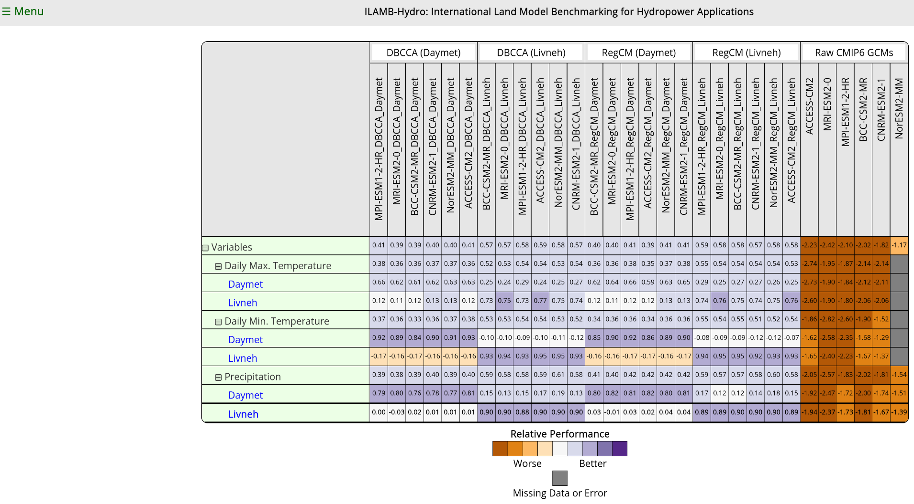

*Figure 1. Default landing page showing average scores across models and downscaling methods.*

---

## Controls

A dropdown menu on the left (Figure 2) allows users to customize the table by choosing the **X and Y dimensions**.

The **X and Y dimensions**, as well as **Other dimensions** in the dropdown, can be set to **models** (e.g., GCMs or downscaled ensembles), **metrics** (e.g., daily precipitation, maximum/minimum temperature), **regions** (e.g., CONUS or HUC2 regions R01–R18), or **statistics** (e.g., annual mean score, seasonal mean score, overall mean score). Select the primary **X** and **Y** dimensions first; the options available in **Other dimensions** then depend on that choice.

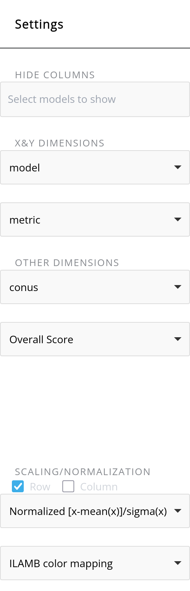{: style="width:70%; height:auto;" }

*Figure 2. Dimension-scaling controls in the settings panel.*

### Example selection

The following settings (Figure 3) produce the plot shown below (Figure 4).

{: width="520" }

*Figure 3. Example settings.*

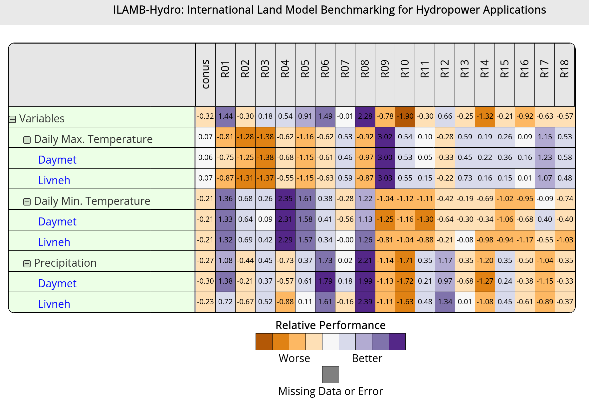{: width="520" }

*Figure 4. Resulting plot from the Figure 3 settings.*

---

## Advanced options

The lower portion of the dropdown (Figure 5) offers advanced controls, including normalization choices, colormap adjustments, title placement, and whether to display values within each cell.

- **Group Header Title**: filter the table by entering a keyword.
- **Toggle Sort Title**: sort labels alphabetically.
- **Save to Image**: export the displayed image in PNG, JPEG, or PDF.

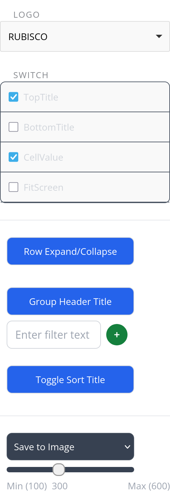

*Figure 5. Advanced option toggles in the settings panel.*

---

## Detailed results

To view detailed results, select a **reference dataset** under the variable you wish to evaluate.

*Figure 6. Scalar table summarizing metrics for the selected variable across all model and downscaling combinations.*

The scalar table (Figure 6) is followed by **annual** and **seasonal** (not shown here) **spatial maps** of various metrics, and **mean time-series** (Figure 7) plots for the chosen model–region combinations from the left menu.

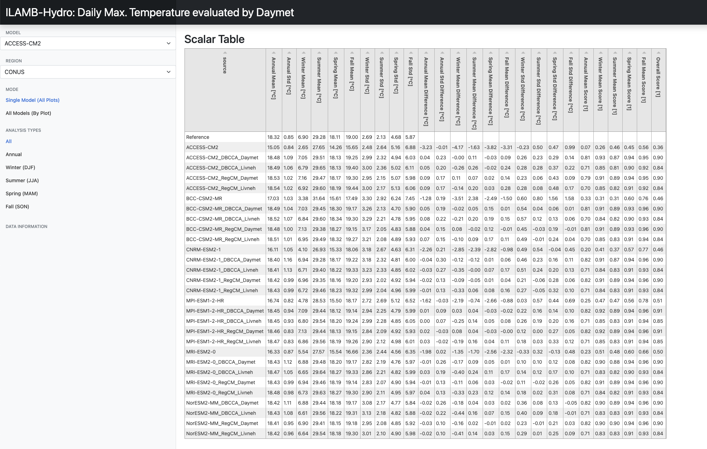

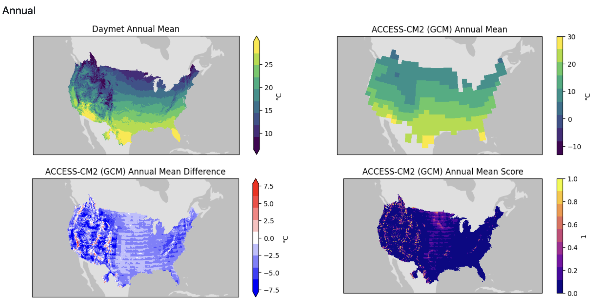

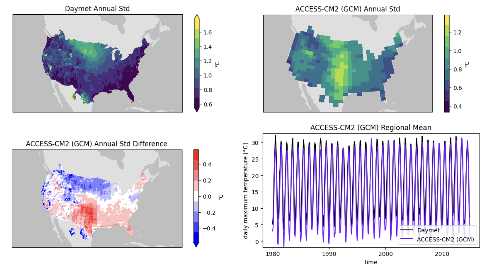

*Figure 7. Spatial map and  mean time-series plot for selected model–region combinations.*

---

## “All Models (By Plot)”

Selecting **All Models (By Plot)** displays spatial maps of the chosen metric for the observations as well as all GCM and downscaling combinations. Use the menu to choose **All**, **Annual**, or **Seasonal** analyses.

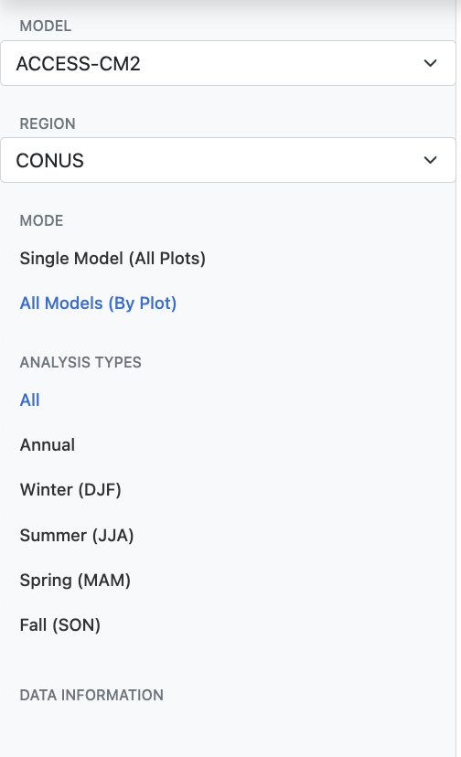

*Figure 8. All-models selection

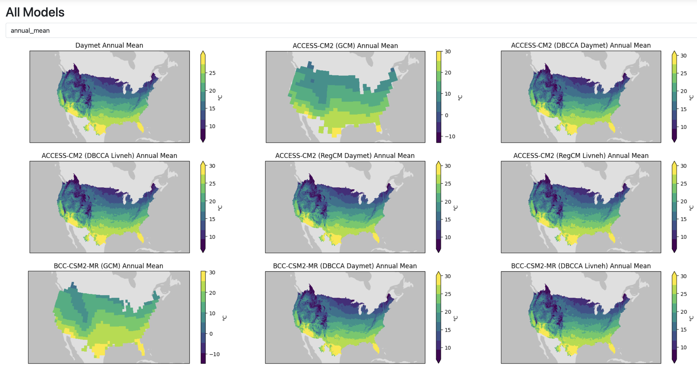

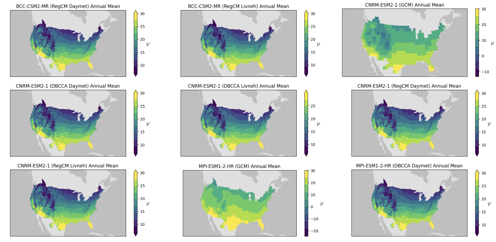

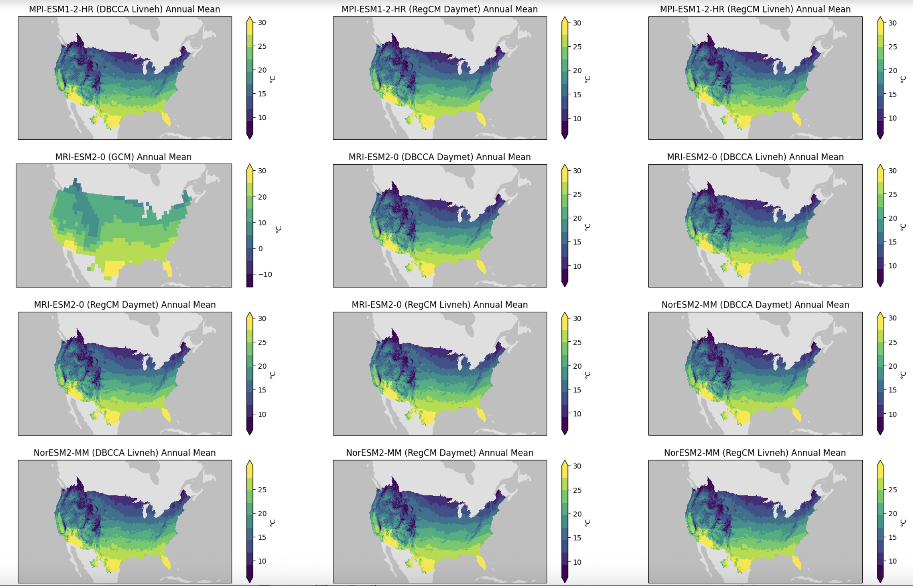

*Figure 9. All-models view

---

## Regional results (HUC2)

You can also select one of the eighteen 2-digit **HUC** regions for  the analysis (Figure 10).

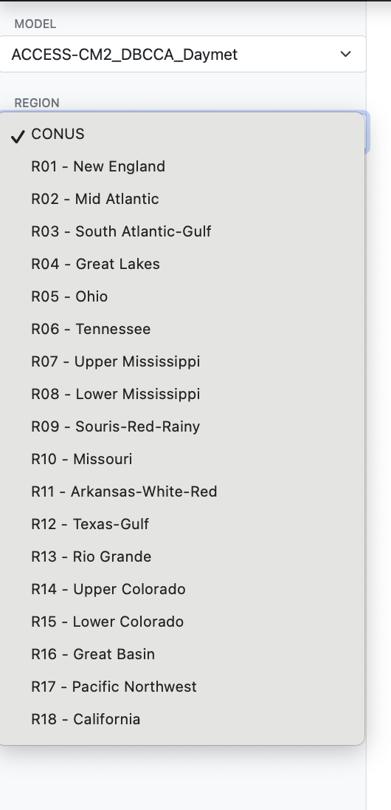

*Figure 10. Regional selection for HUC2.*

### Example: R17 — Pacific Northwest

Selecting **R17—Pacific Northwest** displays the regional scalar table followed by annual and seasonal plots.

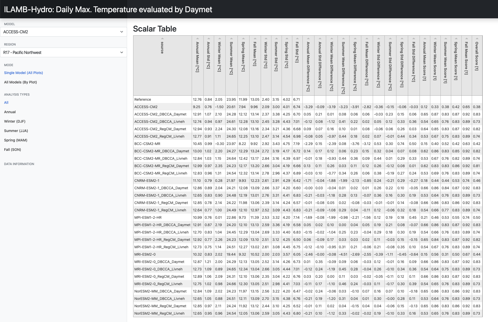

*Figure 11. R17 scalar table.*

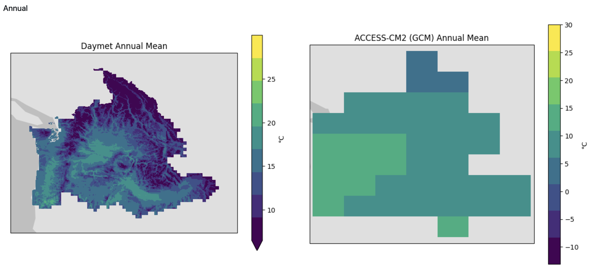

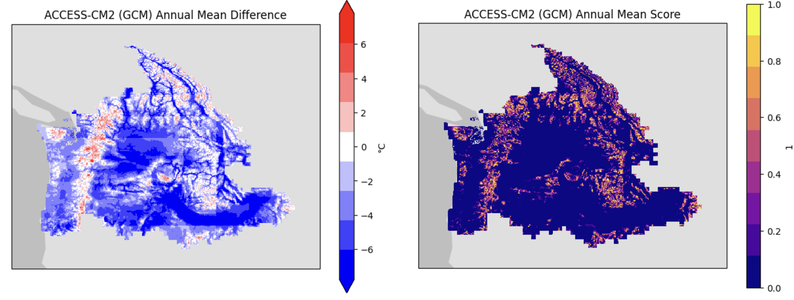

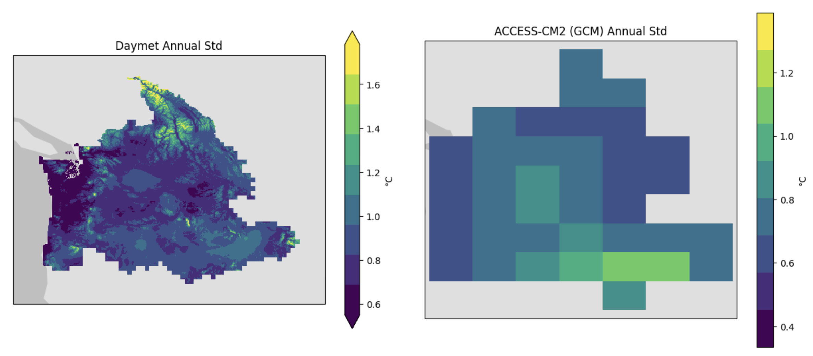

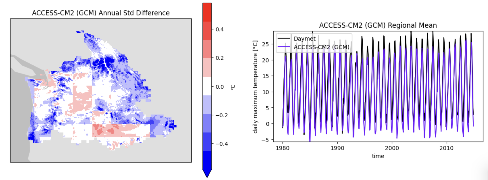

*Figure 12. R17 annual results.*

---

