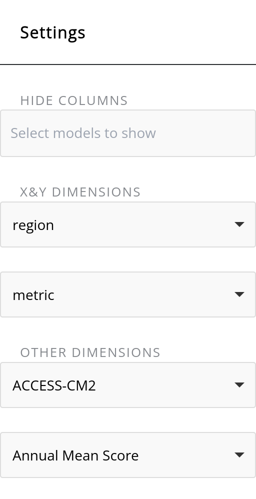

# ILAMB-Hydro: International Land Model Benchmarking for Hydropower Applications

This landing page displays average scores for GCMs and high-resolution downscaled outputs—statistically downscaled (**DBCCA**) and dynamically downscaled and bias-corrected (**RegCM**)—evaluated against two observational datasets: **Daymet** and **Livneh**. Scores are computed following the methodology in Collier et al.

*Figure 1. Default landing page showing average scores across models and downscaling methods.*

---

## Controls

A dropdown menu on the left allows users to customize the table by choosing the **X** and **Y** dimensions.

The **X** and **Y** **dimensions**, as well as **Other dimensions** in the dropdown, can be set to **models** (e.g., GCMs or downscaled ensembles), **metrics** (e.g., daily precipitation, maximum/minimum temperature), **regions** (e.g., CONUS or HUC2 regions R01–R18), or **statistics** (e.g., annual mean score, seasonal mean score, overall mean score). Select the primary **X** and **Y** dimensions first; the options available in **Other dimensions** then depend on that choice.

|  |  |
| --- | --- |

*Figure 2. Controls: (a) dimension scaling; (b) option toggles.*

### Example selection

The following settings produce the plot shown below.

*Figure 3. Example settings.*

*Figure 4. Resulting plot from the Figure 3 settings.*

---

## Advanced options

The lower portion of the dropdown offers advanced controls, including normalization choices, colormap adjustments, title placement, and whether to display values within each cell.

- **Group Header Title**: filter the table by entering a keyword.
- **Toggle Sort Title**: sort labels alphabetically.
- **Save to Image**: export the displayed image in PNG, JPEG, or PDF.

---

## Detailed results

To view detailed results, select a **reference dataset** under the variable you wish to evaluate.

*Figure 5. Scalar table summarizing metrics for the selected variable across all model and downscaling combinations.*

The scalar table is followed by **annual** and **seasonal** (not shown here) **spatial maps** of various metrics, and **mean time-series** plots for the chosen model–region combinations from the left menu.

*Figure 6. Example annual spatial map.*

*Figure 7. Additional spatial map (seasonal views available in the app).*

*Figure 8. Mean time-series plot for selected model–region combinations.*

---

## “All Models (By Plot)”

Selecting **All Models (By Plot)** displays spatial maps of the chosen metric for the observations as well as all GCM and downscaling combinations. Use the menu to choose **All**, **Annual**, or **Seasonal** analyses.

*Figure 9. All-models view, panel 1.*

*Figure 10. All-models view, panel 2.*

*Figure 11. All-models view, panel 3.*

*Figure 12. All-models view, panel 4.*

---

## Regional results (HUC2)

You can also select one of the eighteen 2-digit **HUC** regions to focus the analysis.

*Figure 13. Regional selection for HUC2.*

### Example: R17 — Pacific Northwest

Selecting **R17—Pacific Northwest** displays the regional scalar table followed by annual and seasonal plots.

*Figure 14. R17 scalar table.*

*Figure 15. R17 annual/seasonal results (panel 1).*

*Figure 16. R17 annual/seasonal results (panel 2).*

*Figure 17. R17 annual/seasonal results (panel 3).*

*Figure 18. R17 annual/seasonal results (panel 4).*

---

