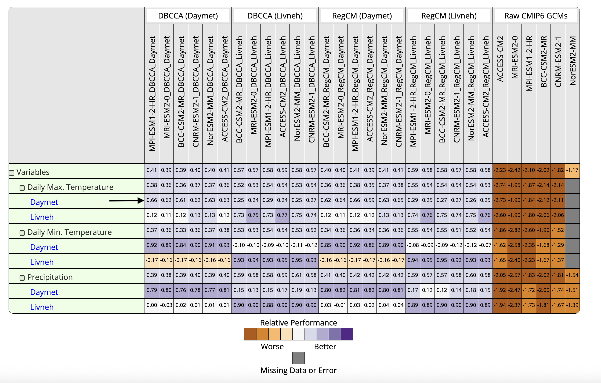

title: ILAMB-Hydro Unified Dashboard

# ILAMB-Hydro: International Land Model Benchmarking for Hydropower Applications

This is the landing page for ILAMB-Hydro. By default, it displays the average scores for both GCMs and high-resolution downscaled outputs: statistically downscaled (DBCCA) and dynamically downscaled and bias-corrected (RegCM), evaluated against two observational datasets: Daymet and Livneh. Scores are computed following the methodology outlined in Collier et al. (cite).

|  |  
| --- | --- |

A dropdown menu on the left allows users to customize the table by selecting different variables for the X and Y axes.

The X and Y DIMENSIONS, as well as the “Other Dimensions” in the dropdown menu, can be selected as models (e.g., GCMs or downscaled ensembles), metrics (e.g., daily precipitation, maximum temperature, minimum temperature), regions (e.g., CONUS or HUC2 regions R01–R18), or statistics (e.g., annual mean score, seasonal mean score, or overall mean score). The primary X and Y dimensions are selected first, and the options available in the 'OTHER Dimensions' dropdown will then depend on the chosen X and Y axes.

For example, the selection shown below produces the following plot. 

The lower section of the dropdown menu offers advanced options such as whether and how to normalize values, adjust color mapping, choose title placement, and the display of values within each cell. Additionally, the "Group Header Title" allows to filter the table display by entering a keyword in the box below. The 'Toggle Sort Title' option allows you to sort the labels alphabetically. The “Save to Image” options option allows to download the displayed image in various formats, including PNG, JPEG, and PDF.

To view more detailed results, select a reference dataset under the variable you wish to evaluate.

This will display a scalar table summarizing metrics calculated for the selected variable across all GCM and downscaling method combinations. Following the table, annual and seasonal (not shown here) spatial maps of various metrics and mean time series plots for the model–region combinations chosen from the menu on the left will be presented.

Selecting ‘All Models (By Plot)’ in the menu will display spatial maps of the chosen metric for the observations as well as for all GCM and downscaling method combinations as shown below. The menu can also be used to select the analysis type: ‘All’, ‘Annual’, or ‘Seasonal’.

The menu can also be used to select and display results for one of the eighteen 2-digit Hydrologic Unit Code (HUC) regions.

For example, selecting ‘R17-Pacific Northwest’ displays the scalar table for the region followed by annual and seasonal (not shown here) plots.

